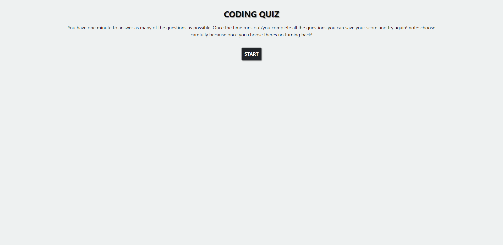

# code-quiz

## Lets take a quiz! 

This is a quick quiz to challenge your coding knowledge, you have 30 seconds to answer as many questions as possible.

Below I have a screenshots of the application.

## Instructions

- Hit the start button and the 30 second timer will start!
- choose your answer carefully because once you do it's on to the next question! and if it's wrong you get a 5 second penalty
- once the quiz is over, you will be presented with your score and the chance to input your initials and save your final score!

## Usage
This application is mostly
 - JavaScript
 - Jquery
 - Bootstrap
 and some light 
 - html
 - css

## Credits
Credit to [Mike Fearnley](https://michaelfearnley.com/) and [Scott Byers](https://github.com/switch120)

as well as [James Q Quick](https://www.youtube.com/channel/UC-T8W79DN6PBnzomelvqJYw) youtube channel.

and the UNH Fullstack Coding Bootcamp

## Links 
Here is the link to the deployed site: https://taylorgonz.github.io/code-quiz/
## Contact

if you want to contact me for any more questions here are my links!

hello@taylorgonz.com
 
[Website](http://www.taylorgonz.com)

## Licensing
 [General Public License](https://opensource.org/licenses/GPL-2.0)
